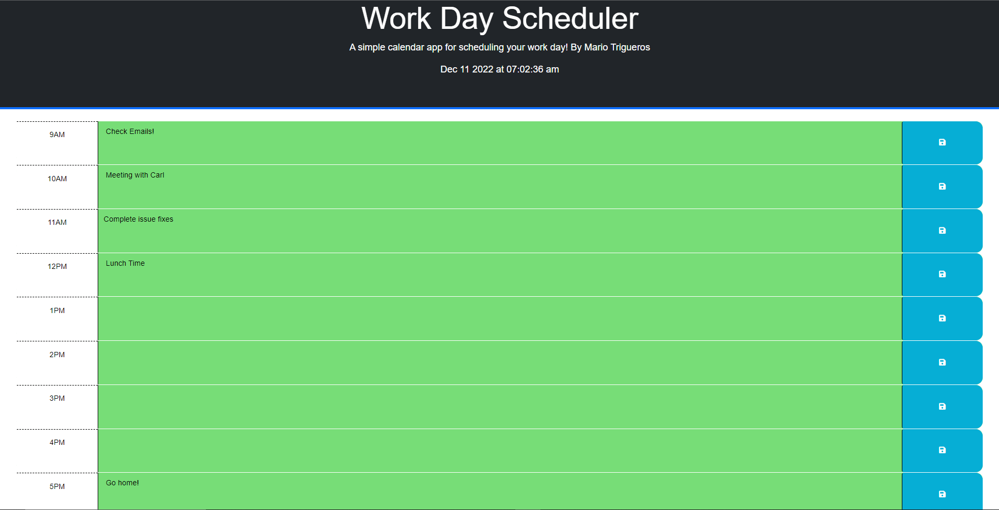

## Work Day Planner

# Description
This website is an organization tool to help the user plan their 9-5 work day. The user can input and save their tasks for each hour of the work day as well as be informed by color backgrounds which hour has passed, is currently happening, or is coming up.

HTML and CSS are used alongside jQuery to dynamically update the website.

# Deployment
https://mariot573.github.io/Work-Day-Planner/

# Screenshots

